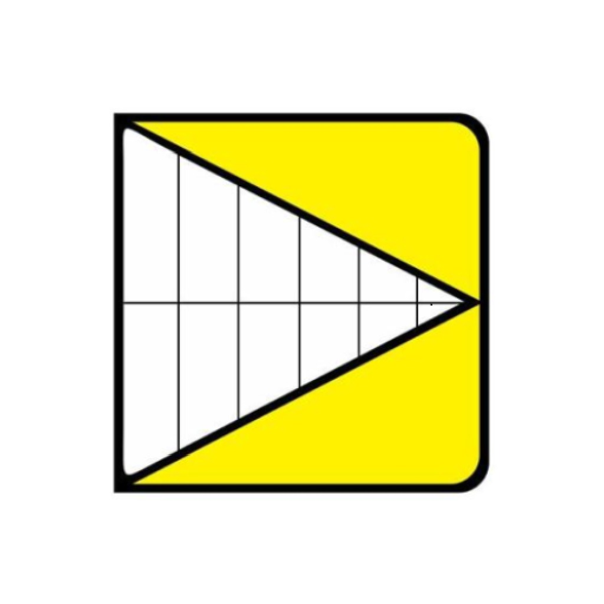

# HALF MOUTH BEER APP

Projeto utilizando Kotlin Multiplatform Mobile(KMM) para exibir informações remotas de monitoramento
de equipamentos da cervejaria artesanal HALF MOUTH.

## 🛠 Ferramentas Utilizadas
- [Compose Multiplatform](https://github.com/JetBrains/compose-multiplatform) - Compose Multiplatform, moderno UI framework para Kotlin.
- [Android Studio](https://developer.android.com/studio/intro) - Android Studio é o oficial IDE (Integrated Development Environment) para desenvolvimento de aplicativos Android.
- [XCode](https://developer.apple.com/xcode/) - Xcode 15.4 para desenvolvimento, integração e testes de aplicativos da plataforma Apple.

## 📚 Bibliotecas Utilizadas

### Core Libs
- **Compose UI Components:**
  - `compose.runtime`
  - `compose.foundation`
  - `compose.material3`
- **Compose Constraint Layout:**
  - `constraintlayout-compose-multiplatform` para ajuste de layout usando constraints.
- **Serialization:**
  - `kotlinx.serialization` para serialização de dados.
- **Date Time Library:**
  - `kotlinx-datetime` para ajuste de data e tempo.
- **Kotlin Coroutines:**
  - `kotlinx.coroutines` para realização de tarefas assíncronas.
- **Gráficos:**
  - `io.github.thechance101:chart` para visualização dos gráficos de linha.
- **Settings:**
  - `com.russhwolf:multiplatform-settings-no-arg` para salvar e acessar dados primitivos através de chave-valor.

### Navigação e ViewModel
- **Compose Navigation:**
  - `navigation-compose` para navegação entre telas.
- **ViewModel Integration:**
  - `lifecycle-viewmodel-compose` para uso de ViewModel em Compose Multiplatform.

### Networking
- **Ktor:**
  - `ktor-client-core`
  - `ktor-client-android`
  - `ktor-client-darwin`
  - `ktor-client-content-negotiation` para realização de network requests.

### Firebase
- **Auth:**
  - `dev.gitlive:firebase-auth` para criação e autenticação de usuários.
- **Real Time Data Base:**
  - `dev.gitlive:firebase-database` para acesso remoto a valores do Real Time Data Base do Firebase.

### Leitor de QR Code
- **QR Kit:**
  - `network.chaintech:qr-kit` para leitura de QR Code através da câmera ou pela galeria do dispositivo.

### Banco de Dados Local
- **Room:**
  - `androidx.room:room-runtime`
  - `androidx.room:room-runtime-android`
  - `androidx.room:room-compiler`
  - `androidx.sqlite:sqlite-bundled` para salvar dados do QR Code no banco de dados local.

### Injeção de Dependências
- **Koin:**
  - `o.insert-koin:koin-android`
  - `io.insert-koin:koin-androidx-compose`
  - `io.insert-koin:koin-core`
  - `io.insert-koin:koin-compose` para injeção de dependências.

## 📂 Trello
- [TRELLO](https://trello.com/b/Jz2V5Q2t/aplicativo-half-mouth) é uma ferramenta visual que possibilita o gerenciamento de projetos, fluxo de trabalho e monitoramento de tarefas.
- Foi gerado um quadro com as tarefas para o desenvolvimento do aplicativo, utilizando a ferramenta Trello: [TAREFAS](https://trello.com/b/Jz2V5Q2t/aplicativo-half-mouth)

### Imagem do Quadro das Tarefas do Aplicativo:

### Exemplo de informacões incluídas no Card da tarefa:
<table>
  <tr>
    <td></td>
    <td></td>
    <td></td>
  </tr>
</table>

## 🚀 Telas do Aplicativo
Screen Shots das Telas Desenvolvidas para as Plataformas Android e iOS.

### Splash Screen
<table>
  <tr>
     <td>Android</td>
     <td>iOS</td>
  </tr>
  <tr>
    <td></td>
    <td></td>
  </tr>
</table>

### Telas do Menu Principal
<table>
  <tr>
     <td>Android</td>
     <td>iOS</td>
  </tr>
  <tr>
    <td></td>
    <td></td>
  </tr>
  <tr>
    <td></td>
    <td></td>
  </tr>
</table>

### Tela de Informação da Produção
<table>
  <tr>
     <td>Android</td>
     <td>iOS</td>
  </tr>
  <tr>
    <td>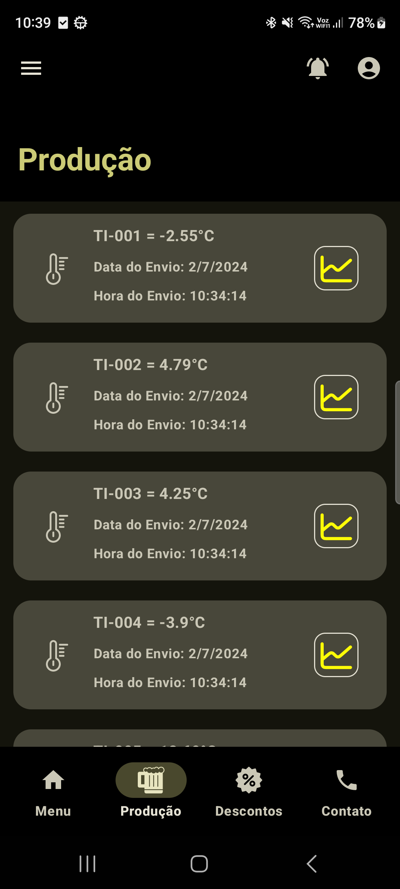</td>
    <td>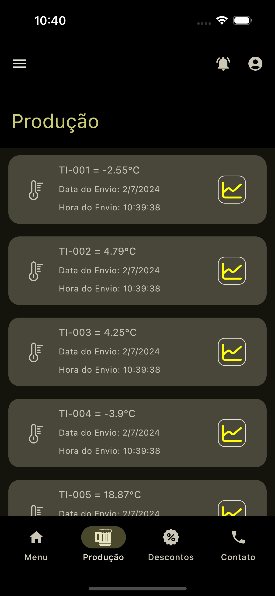</td>
  </tr>
  <tr>
    <td>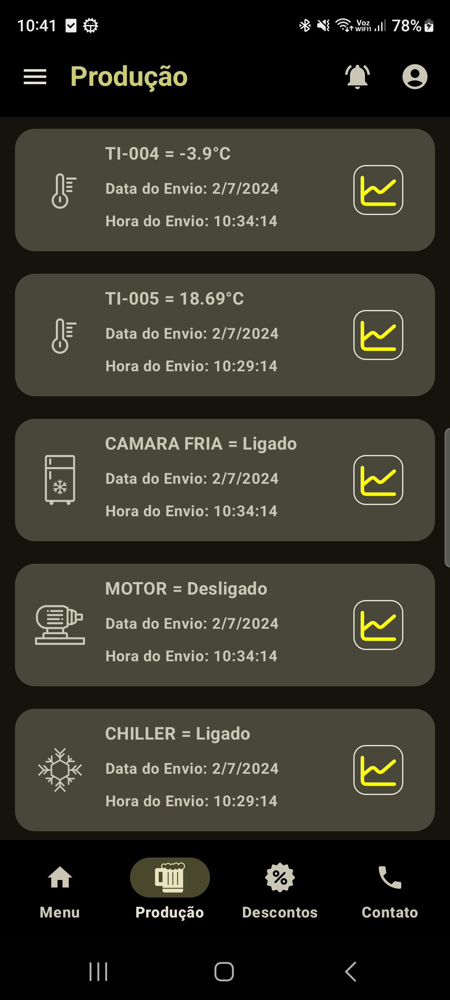</td>
    <td>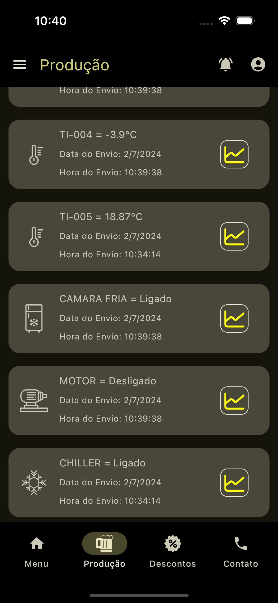</td>
  </tr>
</table>

### Tela de Gráfico
<table>
  <tr>
     <td>Android</td>
     <td>iOS</td>
  </tr>
  <tr>
    <td>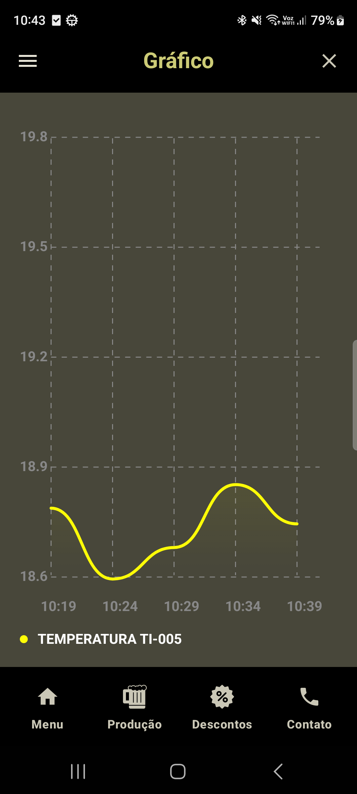</td>
    <td>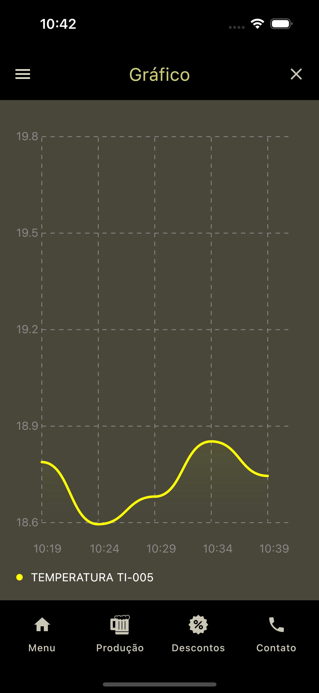</td>
  </tr>
</table>

### Telas do Fluxo de Descontos
<table>
  <tr>
     <td>Android</td>
     <td>iOS</td>
  </tr>
  <tr>
    <td>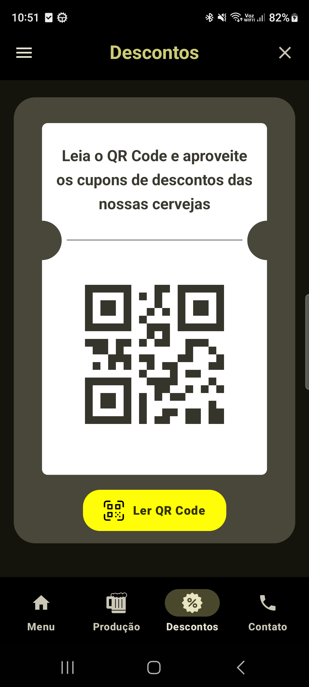</td>
    <td>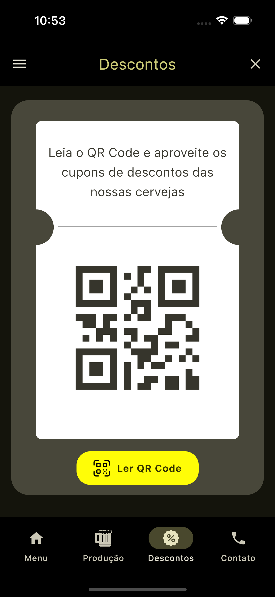</td>
  </tr>
  <tr>
    <td>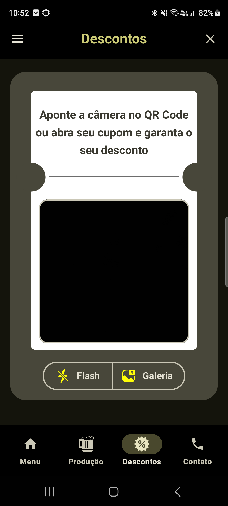</td>
    <td>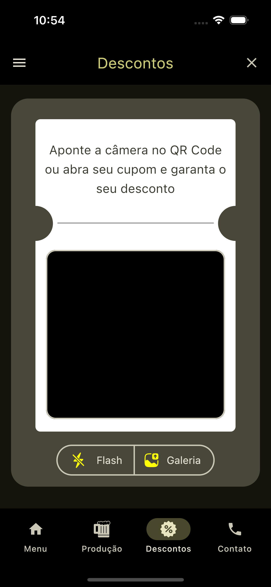</td>
  </tr>
</table>

### Tela de Login do Usuário (Android)
<table>
  <tr>
    <td></td>
    <td></td>
    <td></td>
    <td></td>
  </tr>
</table>

### Tela de Login do Usuário (iOS)
<table>
  <tr>
    <td></td>
    <td></td>
    <td></td>
    <td></td>
  </tr>
</table>

### Tela de Cadastro de Usuário (Android)
<table>
  <tr>
    <td></td>
    <td></td>
    <td></td>
    <td></td>
  </tr>
</table>

### Tela de Cadastro de Usuário (iOS)
<table>
  <tr>
    <td></td>
    <td></td>
    <td></td>
    <td></td>
  </tr>
</table>

### Tela de Perfil (Android)
<table>
  <tr>
    <td></td>
    <td></td>
    <td></td>
  </tr>
</table>

### Tela de Perfil (iOS)
<table>
  <tr>
    <td></td>
    <td></td>    
    <td></td>
  </tr>
</table>
