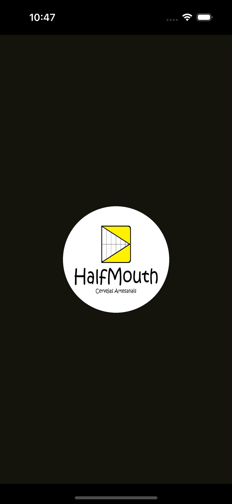

# HalfMouthBeerApp

Projeto utilizando Kotlin Multiplatform Mobile(KMM) para exibir informações remotas de monitoramento
de equipamentos da cervejaria artesanal HalfMouth.

## Telas do Aplicativo

### Splash Screen
<table>
  <tr>
     <td>Android</td>
     <td>iOS</td>
  </tr>
  <tr>
    <td></td>
    <td></td>
  </tr>
 </table>

### Tela de Cadastro de Usuário (Android)
<table>
  <tr>
    <td></td>
    <td></td>
    <td></td>
    <td></td>
  </tr>
 </table>

### Tela de Cadastro de Usuário (iOS)
<table>
  <tr>
    <td></td>
    <td></td>
    <td></td>
    <td></td>
  </tr>
 </table>

### Tela de Login do Usuário:

