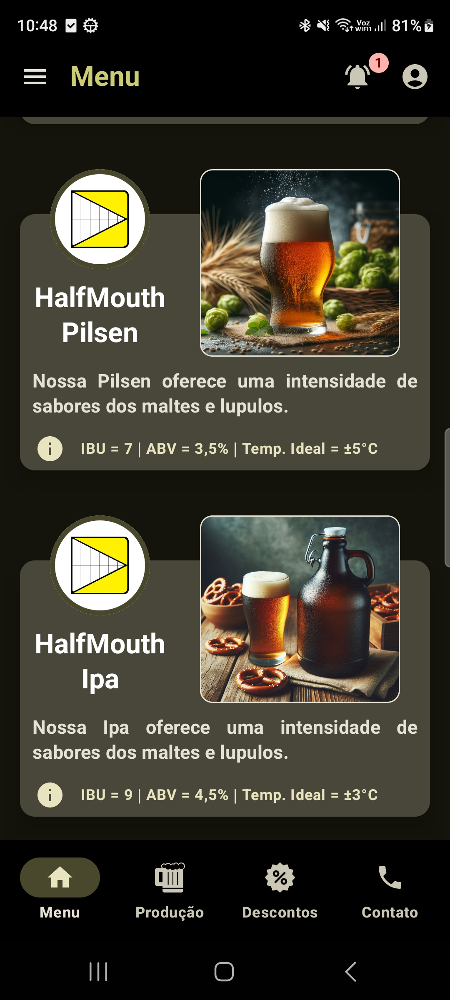

# HalfMouthBeerApp

Projeto utilizando Kotlin Multiplatform Mobile(KMM) para exibir informações remotas de monitoramento
de equipamentos da cervejaria artesanal HalfMouth.

## Ferramentas Utilizadas 🛠
- [Compose Multiplatform](https://github.com/JetBrains/compose-multiplatform) - Compose Multiplatform, moderno UI framework para Kotlin.
- [Android Studio](https://developer.android.com/studio/intro) - Android Studio é o oficial IDE (Integrated Development Environment) para desenvolvimento de aplicativos Androi.
- [XCode](https://developer.apple.com/xcode/) - Xcode 15.4 para desenvolvimento, integração e testes de aplicativos da plataforma Apple.
- [Trello](https://trello.com/b/Jz2V5Q2t/aplicativo-half-mouth) - É uma ferramenta visual que possibilita o gerenciamento de projetos, fluxo de trabalho e monitoramento de tarefas.

## Trello
Quadro do Trello com as tarefas [APLICATIVO HALF MOUTH](https://trello.com/b/Jz2V5Q2t/aplicativo-half-mouth)

Cards das tarefas implementadas para a construção do aplicativo.

Exemplo de informacões incluídas no Card da tarefa.
<table>
  <tr>
    <td></td>
    <td></td>
    <td></td>
  </tr>
</table>

## Telas do Aplicativo
Telas Desenvolvidas para as Plataformas Android e iOS.

### Splash Screen
<table>
  <tr>
     <td>Android</td>
     <td>iOS</td>
  </tr>
  <tr>
    <td></td>
    <td></td>
  </tr>
</table>

### Tela de Login do Usuário (Android)
<table>
  <tr>
    <td></td>
    <td></td>
    <td></td>
    <td></td>
  </tr>
</table>

### Tela de Login do Usuário (iOS)
<table>
  <tr>
    <td></td>
    <td></td>
    <td></td>
    <td></td>
  </tr>
</table>

### Tela de Cadastro de Usuário (Android)
<table>
  <tr>
    <td></td>
    <td></td>
    <td></td>
    <td></td>
  </tr>
</table>

### Tela de Cadastro de Usuário (iOS)
<table>
  <tr>
    <td></td>
    <td></td>
    <td></td>
    <td></td>
  </tr>
</table>

### Tela do Menu Principal (Android)
<table>
  <tr>
    <td></td>
    <td></td>
  </tr>
</table>

### Tela do Menu Principal (iOS)
<table>
  <tr>
    <td></td>
    <td></td>
  </tr>
</table>

### Tela de Perfil (Android)
<table>
  <tr>
    <td></td>
    <td></td>
    <td></td>
  </tr>
</table>

### Tela de Perfil (iOS)
<table>
  <tr>
    <td></td>
    <td></td>    
    <td></td>
  </tr>
</table>